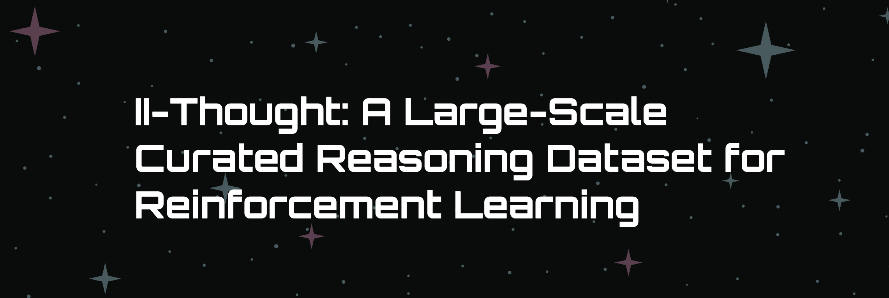

# II-Thought

II-Thought-RL is our initial attempt at developing a large-scale, multi-domain Reinforcement Learning (RL) dataset. By providing a high-quality, large-scale dataset on RL question-answer pairs, we aim to advance reasoning research. This foundational step will pave the way for future iterations incorporating more complex reasoning traces.

This repository contains two frameworks that support our RL dataset:

1. **II-VERL**: A fork of the [Verl](https://github.com/volcengine/verl) framework with enhanced features for RL training
2. **RL Verifier**: A verification framework for evaluating LLM outputs against ground truth

For more details about our project, please visit our [blog post](https://zesty-scooter-4fb.notion.site/II-Thought-RL-v0-1b2c1620efd7800ba7f5ddd860720b15?pvs=74).

## Components

### 1. II-VERL

II-VERL is an enhanced version of the Verl framework with several improvements:

- **Huggingface Dataset Integration**: Direct support for loading datasets from the Huggingface Hub
- **YAML-Based Configuration**: Improved configuration management using YAML files
- **Remote Reward Server**: Support for remote reward computation during training

For detailed documentation and usage instructions, see [II-VERL README](https://github.com/Intelligent-Internet/ii_verl/blob/ii_verl/README.md).

### 2. RL Verifier

The RL Verifier is a comprehensive verification framework that supports multiple domains:

- **Mathematical Tasks**: Using Math-Verify for mathematical expression evaluation
- **Code Generation**: Using Sandbox Fusion for secure code execution and verification
- **Software Engineering Tasks**: Using SWE Verifier for code patch comparison
- **Other Domains**: Using LLM-as-Judge for flexible evaluation

For detailed documentation and usage instructions, see [RL Verifier README](rl_verifier/README.md).

## Installation

### Prerequisites

- Python 3.10+
- Git
- Docker (for code verification features)

### Setup

1. Clone the repository with submodules:
```bash
git clone --recursive https://github.com/Intelligent-Internet/ii_thought.git
cd ii_thought
```

2. Set up II-VERL and RL Verifier:
```bash
cd ii_verl
conda create -n verl python==3.10 -y
conda activate verl

pip3 install torch==2.4.0 --index-url https://download.pytorch.org/whl/cu124
pip3 install flash-attn --no-build-isolation
pip install -e .

cd ../rl_verifier
pip install -r requirements.txt
pip install -e .
```

3. Configure RL Verifier Environment Variables:

Create a `.env` file in the `rl_verifier` directory with the following configurations:

```bash
# For code verification (if using code_verifiable type)
FUSION_SANDBOX_URL=http://localhost:8080

# For LLM-as-Judge (if using llm_judge type)
LLM_JUDGE_MODEL=Qwen/Qwen2.5-32B-Instruct       # Model name
LLM_JUDGE_BASE_URL=http://localhost:8002/v1     # API endpoint (if using local LLM)
LLM_JUDGE_API_KEY=EMPTY                         # API key
LLM_JUDGE_MAX_TOKENS=1000                       # Max output tokens
LLM_JUDGE_TEMPERATURE=0.0                       # Sampling temperature

# Whether to use format verifier
USE_FORMAT_VERIFIER=false                       # Whether to use format verifier
```

4. Set up Code Sandbox (if using code verification):
```bash
# Start the sandbox server
docker run -d  \
    --privileged \
    -p 8080:8080 \
    -e WORKER_SIZE=8 \
    tuenguyen/code_sandbox:server \
    make run-online
```

## Usage

### 1. Starting the RL Verifier Server

```bash
cd rl_verifier
uvicorn src.app.main:app --host 0.0.0.0 --port 8000 --workers 5
```

The server will start on `http://0.0.0.0:8000`.

### 2. Training with II-VERL

1. Prepare your dataset following the format specified in the [II-VERL README](https://github.com/Intelligent-Internet/ii_verl/blob/ii_verl/README.md)

2. Add the following settings to your configuration file, adjust the parameters as needed:

```yaml
reward_api:
  enable: true                    # Enable remote reward server
  api_url: http://localhost:8000  # URL of your reward server
  max_workers: 20                 # Number of concurrent API calls
  timeout: 60                     # Timeout in seconds for each request
  verification_info_column: verification_info  # Column name containing verification info
  save_dir: debug_data/           # Directory for saving reward computation results
  save_freq: 1                    # Save frequency (1 = save after each computation)
```

Example of a full configuration file (GRPO):
```yaml
data:
  tokenizer: null
  train_files: Intelligent-Internet/ii-verl-example
  val_files: Intelligent-Internet/ii-verl-example
  train_split: train
  val_split: test
  prompt_key: messages
  max_prompt_length: 1024
  max_response_length: 8192
  train_batch_size: 128
  val_batch_size: 128
  filter_overlong_prompts: true

actor_rollout_ref:
  model:
    path: deepseek-ai/DeepSeek-R1-Distill-Qwen-1.5B
    enable_gradient_checkpointing: true
    use_remove_padding: true

  actor:
    strategy: fsdp
    ppo_mini_batch_size: 64
    use_dynamic_bsz: true
    ulysses_sequence_parallel_size: 1
    ppo_max_token_len_per_gpu: 32768
    use_kl_loss: True
    kl_loss_coef: 0.001
    kl_loss_type: low_var_kl
    optim:
      lr: 1.0e-06

  ref:
    param_offload: true
    
  rollout:
    name: vllm
    temperature: 0.6
    gpu_memory_utilization: 0.8
    tensor_model_parallel_size: 1
    enforce_eager: false
    free_cache_engine: false
    n: 5
    
reward_model:
  enable: false

# Enable remote reward server
reward_api:
  enable: true
  api_url: http://localhost:8000
  max_workers: 20
  timeout: 60
  verification_info_column: verification_info
  save_dir: debug_data/
  save_freq: 1

algorithm:
  adv_estimator: grpo
  kl_penalty: kl
  kl_ctrl:
    type: fixed
    kl_coef: 0.001

trainer:
  total_epochs: 15
  project_name: ii-thought-rl
  experiment_name: ii-grpo
  nnodes: 1
  n_gpus_per_node: 8
  save_freq: 25
  test_freq: 25
  default_local_dir: checkpoints/ii-grpo
```

3. Start training:
```bash
verl train-ppo --config_path config.yaml
```